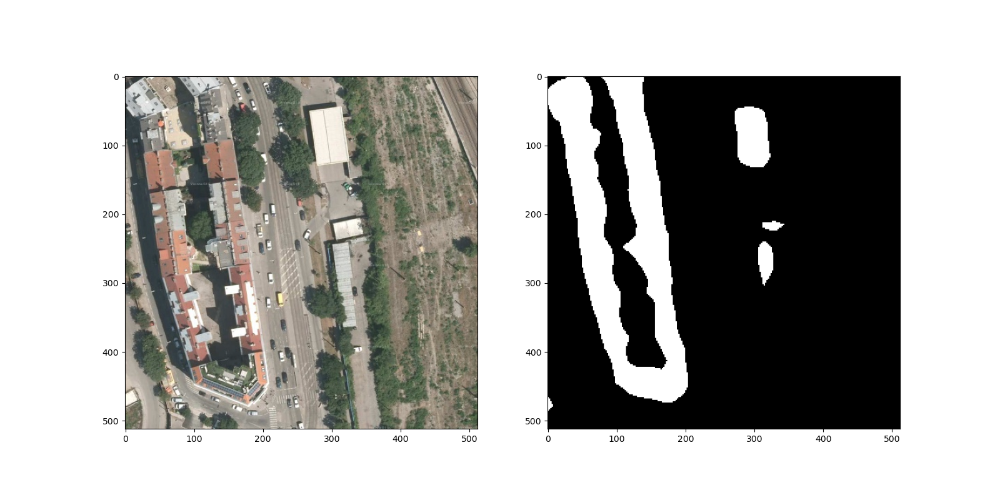
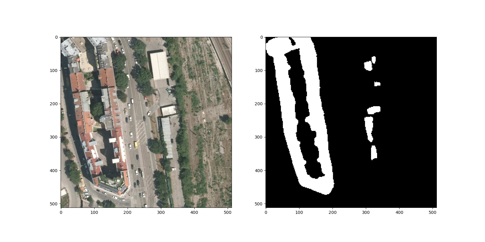

# Semantic-segmentation-Tianchi

## Intro

最近的项目推动需要学习语义分割的知识，借这个机会把传统的语义分割模型都实现一遍，当作实验下半年论文和比赛的baseline（ref: https://tianchi.aliyun.com/competition/entrance/531872/introduction）

## Results

H：HorizontalFlip

V：VerticalFlip

Ro：RandomRotate90

ReN：Resize（推理时将原图片Resize成256然后输入，最后最近邻插值获得结果）

ReL：Resize（推理时将原图片Resize成256然后输入，最后双线性插值获得结果）

|   Method   |   Score    |
| :--------: | :--------: |
|    FCN     |   0.7582   |
|   FCN+H    |   0.7625   |
| FCN+H+ReN  | **0.7980** |
| FCN+H+V+Ro |   0.7572   |
| U-net+ReN  | **0.8641** |

## Display

* FCN + H

* FCN + H + ReN

* U-net

* U-net + ReN

