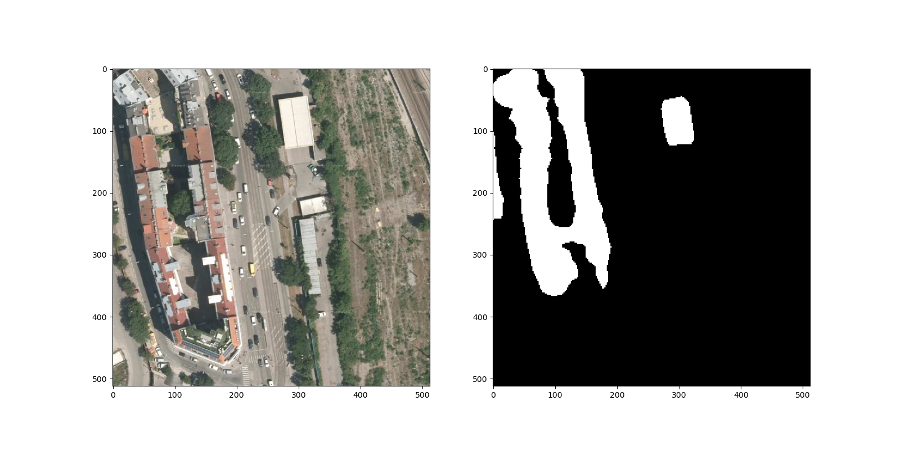

# Semantic-segmentation-Tianchi

## Intro

Semantic segmentation experiments on Aliyun Tianchi remote sensing segmentation dataset. Models include FCN, U-net, and PSPNet Contest link: https://tianchi.aliyun.com/competition/entrance/531872/introduction

## Results

H：HorizontalFlip

V：VerticalFlip

Ro：RandomRotate90

ReN：Resize（推理时将原图片Resize成256然后输入，最后最近邻插值获得结果）

|      Method       |   Score    |
| :---------------: | :--------: |
|        FCN        |   0.7582   |
|       FCN+H       |   0.7625   |
|     FCN+H+ReN     | **0.7980** |
|    FCN+H+V+Ro     |   0.7572   |
|     U-net+ReN     | **0.8641** |
| PSPNet+H+V+Ro+ReN |   0.5696   |

## Display

* FCN + H

* FCN + H + ReN

* U-net

* U-net + ReN

* PSPNet+H+V+Ro+ReN

